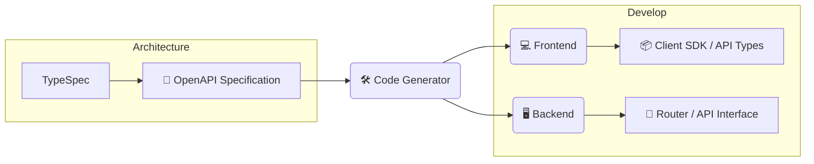

## 自己紹介

<div class="my-0">
    <p style="white-space:pre-wrap">{{"株式会社LIXIL\r\nアプリケーションエキスパート"}}</p>
    <h2>Hal</h2>
</div>
<p>Vue.js / Nuxt, TypeScript, Google Cloud, Python, Rust</p>
<p>最近は写真にハマっています📷</p>

---
layout: default
---

<SectionTitle title="スキーマ駆動開発を知っていますか？🙋"/>

---

<WhatIsSDD/>

---

## イメージ

<div style="height:6rem"/>



---

## 実装するとこんな感じ

#### OpenAPI

```yml
# openapi.yml
```

#### TypeScript

```ts
type hoge = {}
```

#### Java(POJO)

```java
class Example {
    aaa: String;
}
```

---

## スキーマ駆動開発(SDD)のメリット

<div style="height:3rem"/>

1. スキーマ定義からフロントエンド(FE)・バックエンド(BE)のinterfaceを自動生成
   - FE・BE間でのコミュニケーションコストが下がる
2. APIドキュメントの自動生成(Redocly,Swagger)
3. API仕様変更による不整合を避けられる
   - スキーマ定義を変更→実装修正というサイクルを守る
   - FE,BEどちらとも設計に参加する

---
transition: fade
---

<SectionTitle title="スキーマ駆動開発は便利なので積極的に採用しよう！"/>

---
transition: blur-transition
---

<SectionTitle title="...🤔"/>
