## 自己紹介

<div class="my-0">
    <p style="white-space:pre-wrap">{{"株式会社LIXIL\r\nアプリケーションエキスパート"}}</p>
    <h2>Hal</h2>
</div>
<p>Vue.js / Nuxt, TypeScript, Google Cloud, Python, Rust</p>
<p>最近は写真にハマっています📷</p>

---
layout: default
---

<SectionTitle title="スキーマ駆動開発を知っていますか？🙋"/>

---

<WhatIsSDD/>

---
class: font-bold
---

## イメージ

```mermaid
graph LR
    A0[TypeSpec] --> A[📄 OpenAPI Specification]
    style A0 stroke-dasharray: 5 5
    A --> B(🛠️ Code Generator);
    B --> C(💻 Frontend);
    B --> D(🖥️ Backend);

    C --> C1[📦 Client SDK / API Types];
    D --> D1[📂 Router / API Interface];

    subgraph Architecture
        A0
        A
    end

    subgraph Develop
        C
        C1
        D
        D1
    end

```

<div style="height:6rem"/>



---
drawings:
  persist: true
class: font-bold
---

### OpenAPI

<p v-click="1" v-click.hide="2" v-drag="[501,250,154,53]">Query Parameter</p>

<p v-click="2" v-click.hide="3" v-drag="[534,429,88,52]">Response</p>

````md magic-move {at: 2, lines: true}
```yml {8-16|17-23}
# openapi.yml
…
paths:
  /users/{userId}:
    get:
      summary: 特定のユーザー情報を取得
      operationId: getUserById
      parameters:
        - name: userId
          in: path
          required: true
          description: 取得したいユーザーのID
          schema:
            type: integer
            format: int64
            example: 101
      responses:
        '200':
          description: ユーザー情報の取得に成功
          content:
            application/json:
              schema:
                $ref: '#/components/schemas/User'
```

```yml {*|6-10}
components:
  schemas:
    User:
      type: object
      properties:
        id:
          type: integer
          format: int64
          description: ユーザーID
          example: 101
```
````

---

#### TypeScript

````md magic-move {at:2, lines: true}
```ts {11-13|16-21}
export interface paths {
  '/users/{userId}': {
    …
    get: operations["getUserById"]
  }
}

export interface operations {
    getUserById: {
        parameters: {
            query: {
                userId: string;
            }
        },
        responses: {
            200: {
                headers: {…},
                content: {
                    "application/json": components["schemas"]["User"]
                }
            }
        },
    }
}

```

```ts
export interface components {
  schemas: {
    User: {
      id: string
    }
  }
}
```
````

---

#### Java(POJO)

Javaは `model.mustache` で出力する際のテンプレートを定義可能

```java
public class getUserByIdRequest {
    private String userId = null; //説明文
}

public class getUserByIdResponse {
    private String id = null; //説明文
}
```

---

## スキーマ駆動開発(SDD)のメリット

<div style="height:3rem"/>

1. スキーマ定義からフロントエンド(FE)・バックエンド(BE)のinterfaceを自動生成
   - FE・BE間でのコミュニケーションコストが下がる
2. APIドキュメントの自動生成(Redocly,Swagger)
3. API仕様変更による不整合を避けられる
   - スキーマ定義を変更→実装修正というサイクルを守る
   - FE,BEどちらとも設計に参加する

---
transition: fade
---

<SectionTitle title="スキーマ駆動開発は便利なので積極的に採用しよう！"/>

---
transition: blur-transition
---

<SectionTitle title="...🤔"/>
