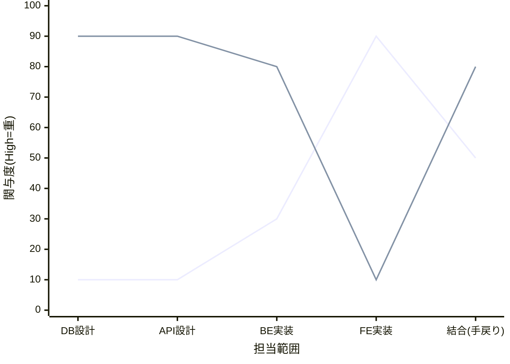
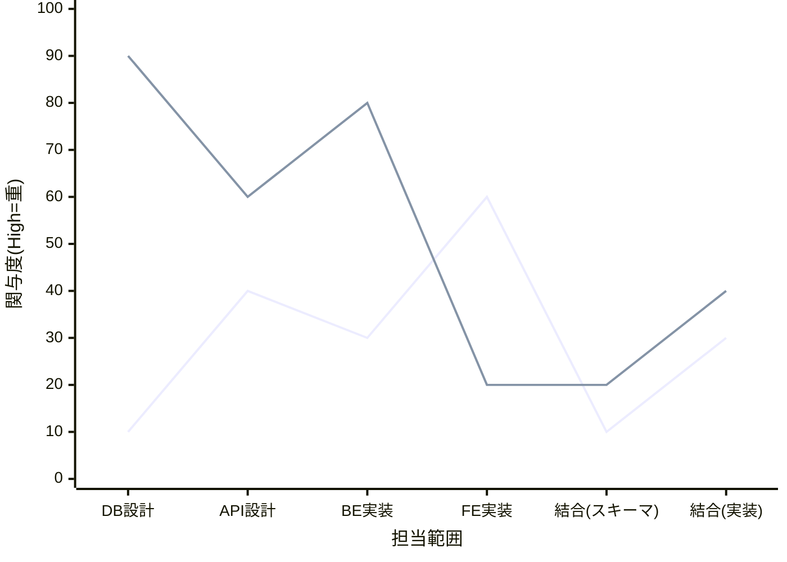
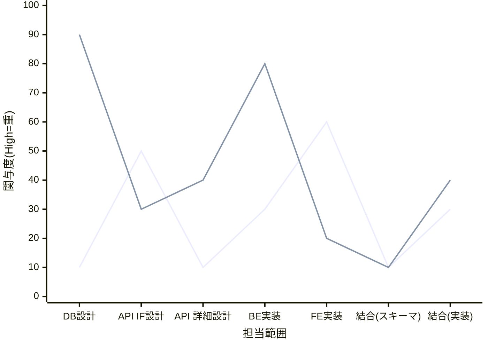
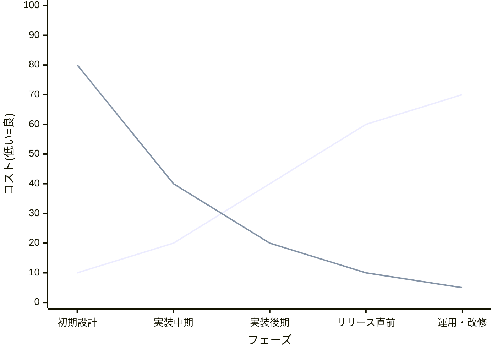

<SectionTitle title="スキーマ駆動開発のトレードオフ構造" />

---

## トレードオフとなるもの

| 変数         | 対称となる項目                    | 議論のポイント            |
| ------------ | --------------------------------- | ------------------------- |
| 担当する範囲 | FEエンジニア<->BEエンジニア       | Who(誰がどのくらいやるか) |
| API IFの起点 | スキーマ<->実装                   | When(いつから変えるか)    |
| コスト       | ベネフィット<->メンテナンスコスト | What(何を重視するか)      |

---
transition: fade
---

##### スキーマを使わない開発

青：FE, 緑：BE

結合で手戻りが大きくなりやすい

---
transition: fade
---

##### 中間言語を用いたSDDにおけるコストシフト

青：FE, 緑：BE

結合コストは下がるが、BEの全体関与度が上がる

---

##### APIの設計をインターフェース、詳細で分離し、FEが関与しやすくする

青：FE, 緑：BE

着手する順番・比率を変えれば総合関与度は多少マシになる

<SectionTitle v-click style="z-index:500;position:absolute;top:0;left:0;background:#000c" title="ただしスキーマのメンテ・学習コストは考慮されていない" />

---

## そもそもインターフェースは誰が責任を持つものなのか？

 

#### APIを実装するのはBEだからBEエンジニアだ！

→BEエンジニアに定義してもらったIFがFEで取り回しづらい構造だったらその都度修正してもらう？

提案時点で実装の目処を立てている可能性もある

 

#### APIを使うのはFEだからFEエンジニアだ！

→DB、実装の詳細を掴んでいない状況でのIFは突飛なものになる可能性がある

---

## スキーマ駆動に求められるもの

   <SectionCard  style="width:50%" class="pa-3 mr-5">
      <h4>FE</h4>
      <ul>
         <li>APIのIFを手動で定義せずに済むようになりたい</li>
         <li>早くAPIのIFを合意取り、実装に進みたい</li>
         <li>手戻りが少ない形でAPI部の実装を進めたい</li>
      </ul>
   </SectionCard>

   <SectionCard style="width:50%" class="pa-3">
      <h4>BE</h4>
      <ul>
         <li>FEが必要としているI/Oが知りたい</li>
         <li>バリデーションすべき値を把握したい</li>
         <li>APIによって何を果たしたいのか知りたい(もしかしたら要件レベルかも)</li>
         <li>APIドキュメントのメンテナンスコストを下げたい</li>
         <li>手戻りが少ない形で実装を進めたい</li>
      </ul>
   </SectionCard>

---

## 提案する運用アプローチ

1. 両者が持つ範囲を決める
   - FE: APIの主目的、リクエスト・レスポンスと「各項目の説明」
   - BE: APIの振る舞いについての説明、リクエスト・レスポンスの具体的な返却パターン
2. FEエンジニアがまずspecを作成し、以下情報を書く
   - APIの目的
   - リクエスト（必須、文字数、Regex等も）
   - レスポンス
3. BEエンジニアがレビューし、commitを追加する
   - APIの振る舞いの詳細な説明
   - リクエスト・レスポンスのexample(複数パターンある場合は全て追加)
   - エラーパターン(4**,5**)
4. FEエンジニアがレビューし、合意が取れたらマージする
5. IF、ドキュメントを生成する

**このパターンは中間言語を使わない場合でも適用可能**

---

## イメージ図

```mermaid {scale: 0.7}
graph LR
    %% ノードの定義
    Step1["<b>1. 範囲の合意</b><br/>FE: 構造と型<br/>BE: 振る舞い"]
    Step2["<b>2. FE: Specドラフト</b><br/>・API目的<br/>・Request(必須/Regex)<br/>・Response構造"]
    Step3["<b>3. BE: 詳細追記</b><br/>・振る舞いの説明<br/>・Example(全パターン)<br/>・Error(4xx/5xx)"]
    Step4["<b>4. FE: 最終確認</b><br/>・レビュー<br/>・合意＆マージ"]
    Step5["<b>5. 自動生成</b><br/>・IF型定義<br/>・ドキュメント"]

    %% フローの接続
    Step1 --> Step2
    Step2 -- PR作成 --> Step3
    Step3 -- 修正/Review --> Step4
    Step4 --> Step5

    %% スタイル定義（ダークモード用）
    classDef default color:#fff,stroke-width:2px;

    %% FEのタスク（青系）
    classDef fe fill:#0d47a1,stroke:#64b5f6;
    %% BEのタスク（オレンジ/茶系）
    classDef be fill:#e65100,stroke:#ffb74d;
    %% 共通・システム（グレー系）
    classDef common fill:#424242,stroke:#bdbdbd;

    %% クラス適用
    class Step2,Step4 fe;
    class Step3 be;
    class Step1,Step5 common;
```

 
 

---

## 注意点

- 小規模、またはフルスタックに行う場合には向かないアプローチ（かえって冗長になる）
- エンジニアが互いのレイヤーを触れないチームでは実現できないことがある
  - セキュリティ、スキルセット、チームの事情etc.

---

<SectionTitle :title="'コストバランスと「スキーマ運用の設計合意=契約」\r\n をどう考えるか'"/>

---

## コストがベネフィットを上回る原因

 

1. コストが利点を上回っていない
   - セットアップ、学習、運用コストに対して生成されるIFが少ない
   - 一人でFE,BEどちらとも面倒を見ている
2. コストそのものが高すぎる
   - OpenAPIを保守し続けるのは結構大変
   - 小規模ならCIは大げさ、大規模なら手動同期は手間がかかりすぎる

 

<h3 v-drag="[322,380,339,56]" class="text-center">規模に合った運用設計を！</h3>

---

## 実装が優先？スキーマが優先？

 

- 実装されているBEコード量が多く、APIクライアントとして体裁が整っているなら実装優先の方がシフトしやすい
  - ただし実装優先した場合はFE側で変更に気づける仕組みが重要→pull型ではなくpush型で知らせる！
- まだBEコードが少なく、これから構築と設計を始めるのであればスキーマ優先で効果が出るが、コストバランスのパラダイムシフトを考えると将来的に移行しても良いかも

---

##### コストのシフト

青：スキーマ起点, 緑：実装起点

開発フェーズが進むとAPI定義のサイクルが安定し、 実装起点の方が効果的に進めやすくなる

<SectionTitle v-click style="z-index:500;position:absolute;top:0;left:0;background:#000c" :title="'フェーズによってコスト構造が徐々に変わっていくなら\r\nどちらを採用すれば良い？'" />

---
transition: fade
---

<SectionTitle :title="'正解は１つではない'"/>

---

<SectionTitle :title="'プロジェクトの背景・時間軸・規模・ \r\nスキルセット等によって適した選定が必要！'"/>

---
transition: fade
---

<SectionTitle title="コストが小さく抑えられる構成は？"/>
