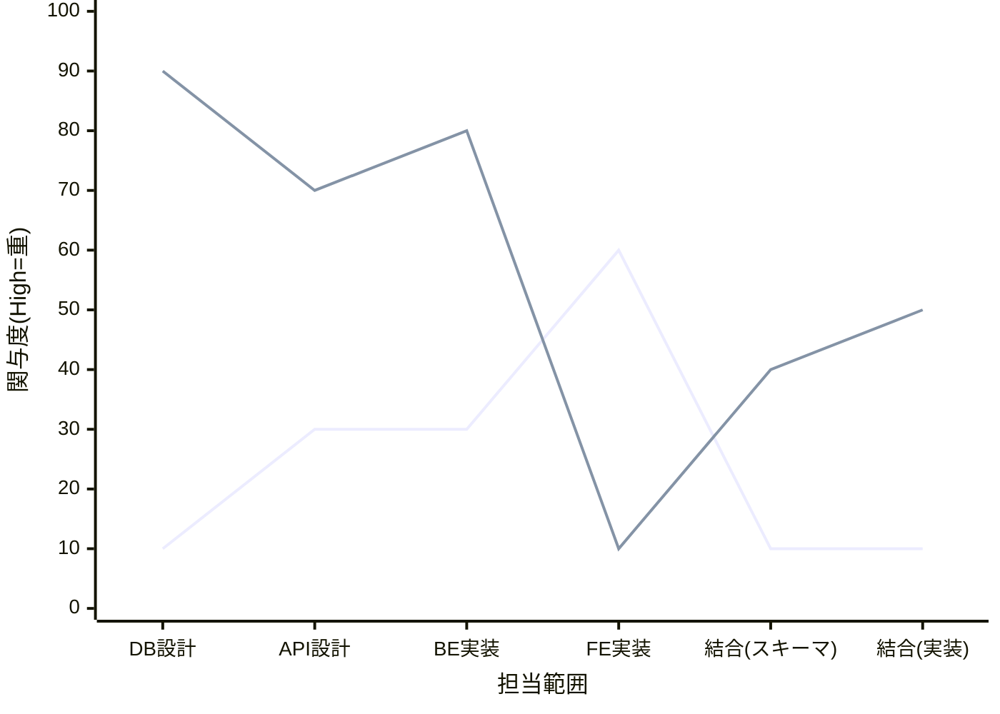
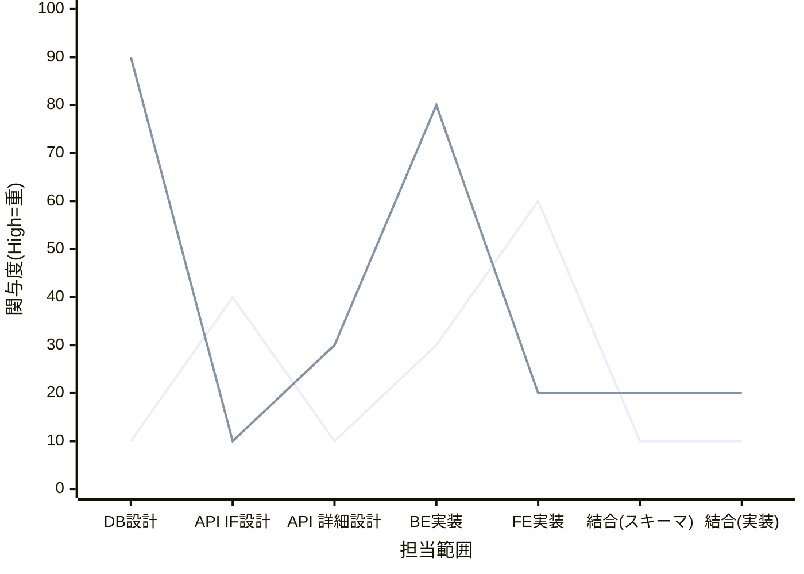
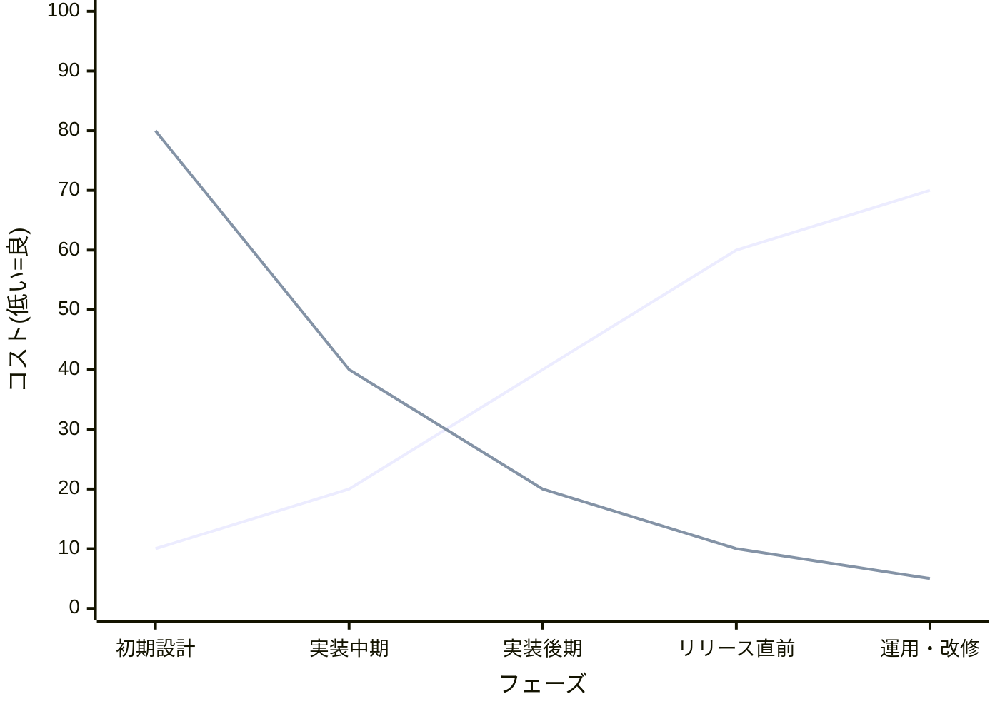

<SectionTitle title="SDDの変化するトレードオフ" />

---

## トレードオフとなるもの

 

| 変数         | 対称となる項目                    | 議論のポイント            |
| ------------ | --------------------------------- | ------------------------- |
| 担当する範囲 | FEエンジニア<->BEエンジニア       | Who(誰がどのくらいやるか) |
| API IFの起点 | スキーマ<->実装                   | When(いつから変えるか)    |
| コスト       | ベネフィット<->メンテナンスコスト | What(何を重視するか)      |

---

<SectionTitle title="担当範囲とコスト"/>

---
transition: fade
---

##### スキーマを使わない開発

青：FE, 緑：BE

関与度が低いほど負荷が少ない

<h4 v-drag="[732,183,163,52]" class="text-center">{{"結合で手戻りが\t\n大きくなりやすい"}}</h4>

   
FE: 200

   
BE: 350

---
transition: fade
---

##### 中間言語を用いたSDDにおけるコストシフト

青：FE, 緑：BE

{{"結合コストは両者とも下がるが、\r\nBEの全体関与度があまり下がらない"}}

   
FE: 150(-25.0%)

   
BE: 340(-2.8%)

---

##### API設計をIF・詳細で分離し、FEが関与できる範囲を広げる

青：FE, 緑：BE

着手する順番・比率を変えればマシになる

   
FE: 170(-15.0%)

   
BE: 270(-22.9%)

<SectionTitle v-click style="z-index:500;position:absolute;top:0;left:0;background:#000c" title="ただしスキーマのメンテ・学習コストは考慮されていない" />

---

## Pose a question(問いかけ):

## そもそもインターフェースは誰が責任を持つものなのか？

 

#### APIを実装するのはBEだからBEエンジニアだ！

→BEエンジニアに定義してもらったIFがFEで取り回しづらい構造だったらその都度修正してもらう？

提案時点で実装の目処を立てている可能性もある

 

#### APIを使うのはFEだからFEエンジニアだ！

→DB、実装の詳細を掴んでいない状況でのIFは突飛なものになる可能性がある

<h3 v-click v-drag="[257,422,497,65]" class="text-center font-bold">少なくともチーム内でこの問いかけに対する回答を持ってほしい</h3>

---
transition: fade
---

<SectionTitle :title="'担当範囲の調整・工程の入れ替えによって\r\nコストが少し下がることがわかった。'"/>

---

<SectionTitle :title="'では具体的にどうする？'"/>

---

## 確認：スキーマ駆動に求められるもの

   <SectionCard  style="width:50%" class="pa-3 mr-5">
      <h4>FE</h4>
      <ul>
         <li>API IFのメンテコストを下げたい</li>
         <li>早くAPI IFの合意を取り、実装に進みたい</li>
         <li>手戻りが少ない形でAPI連携部の実装を進めたい</li>
      </ul>
   </SectionCard>

   <SectionCard style="width:50%" class="pa-3">
      <h4>BE</h4>
      <ul>
         <li>FEが必要としているI/Oが知りたい</li>
         <li>バリデーションすべき値を把握したい</li>
         <li>APIによって何を果たしたいのか知りたい</li>
         <li>APIドキュメントのメンテコストを下げたい</li>
         <li>手戻りが少ない形で実装を進めたい</li>
      </ul>
   </SectionCard>

---

## 提案する運用アプローチ

   

      <h4>1. 両者が持つ範囲を決める</h4>
      <ul class="text-sm ml-5">
         <li>FE: APIの主目的、リクエスト・レスポンスと「各項目の説明」→抽象</li>
         <li>BE: APIの振る舞いについての説明、リクエスト・レスポンスの返却パターン→具体</li>
      </ul>
   

   

      <h4>2. FEエンジニアがまずspecを作成し、抽象を追加する</h4>
      <ul class="text-sm ml-5">
         <li>APIの目的</li>
         <li>リクエスト（必須、文字数、Regex等も）</li>
         <li>レスポンス</li>
      </ul>
   

   

      <h4>3. BEエンジニアがレビューし、具体を追加する</h4>
      <ul class="text-sm ml-5">
         <li>APIの振る舞いの詳細な説明</li>
         <li>リクエスト・レスポンスのexample(複数パターンある場合は全て追加)</li>
         <li>エラーパターン(4XX,5XX)</li>
      </ul>
   

   <h4 v-click class="my-1">4. FEエンジニアがレビューし、合意が取れたらマージする</h4>

   <h4 v-click class="my-1">5. IF、ドキュメントを生成する</h4>

---

## イメージ図

```mermaid {scale: 0.7}
graph LR
    %% ノードの定義
    Step1["<b>1. 範囲の合意</b><br/>FE: 構造と型<br/>BE: 振る舞い"]
    Step2["<b>2. FE: Specドラフト</b><br/>・API目的<br/>・Request(必須/Regex)<br/>・Response構造"]
    Step3["<b>3. BE: 詳細追記</b><br/>・振る舞いの説明<br/>・Example(全パターン)<br/>・Error(4xx/5xx)"]
    Step4["<b>4. FE: 最終確認</b><br/>・レビュー<br/>・合意＆マージ"]
    Step5["<b>5. 自動生成</b><br/>・IF型定義<br/>・ドキュメント"]

    %% フローの接続
    Step1 --> Step2
    Step2 -- PR作成 --> Step3
    Step3 -- 修正/Review --> Step4
    Step4 --> Step5

    %% スタイル定義（ダークモード用）
    classDef default color:#fff,stroke-width:2px;

    %% FEのタスク（青系）
    classDef fe fill:#0d47a1,stroke:#64b5f6;
    %% BEのタスク（オレンジ/茶系）
    classDef be fill:#e65100,stroke:#ffb74d;
    %% 共通・システム（グレー系）
    classDef common fill:#424242,stroke:#bdbdbd;

    %% クラス適用
    class Step2,Step4 fe;
    class Step3 be;
    class Step1,Step5 common;
```

 
 

 
 

### 注意点

- 小規模、またはフルスタックに行う場合には向かないアプローチ（かえって冗長になる）
- エンジニアが互いのレイヤーを触れないチームでは実現できないことがある
  - セキュリティ、スキルセット、チームの事情etc.

このパターンは中間言語を使わない場合でも適用可能

---

<SectionTitle title="IFの起点とコスト"/>

---

##### コストのシフト

青：スキーマ起点, 緑：実装起点

開発フェーズが進むとAPI開発のサイクルが安定し、 実装起点の方が効果的に進めやすくなる

<SectionTitle v-click style="z-index:500;position:absolute;top:0;left:0;background:#000c" :title="'フェーズによってコスト構造が徐々に変わっていくなら\r\nどちらを採用すれば良い？'" />

---
transition: fade
---

<SectionTitle :title="'A. 多少のオーバーヘッドを飲み込み、固定して進める \r\n \r\n B. フェーズに応じて計画的に移行する'"/>

---
transition: fade
---

## 要約： コストがベネフィットを上回る原因

 

<h3 class="font-bold">人チーム・プロダクト・スキルセットにマッチしていない</h3>

- セットアップ、学習、運用コストに対して生成されるIFが少ない
- FE,BEどちらが担当した方がより早いか
- 一人でFE,BEどちらとも面倒を見ている場合は必要か？
- 小規模ならCIは大げさ、大規模なら手動同期は手間がかかりすぎる

 

<h3 class="font-bold">時間軸開発フェーズとマッチしていない</h3>

- 時間軸と優先するソースでROIは大きく変わる

 

<h3 class="font-bold">絶対的コストコストそのものが高すぎる</h3>

- OpenAPIを生のまま保守し続けるのは結構大変

<SectionTitle v-click style="position:absolute;top:0;left:0;background:#000c" :title="'開発のチーム・時間軸・ \r\n発生する絶対的コストを見積もった上での選定が重要！'"/>

---

<SectionTitle :title="'これまでの話を踏まえ、コストバランスと\r\n 「スキーマ運用の設計合意=契約」をどう考えるか'"/>
