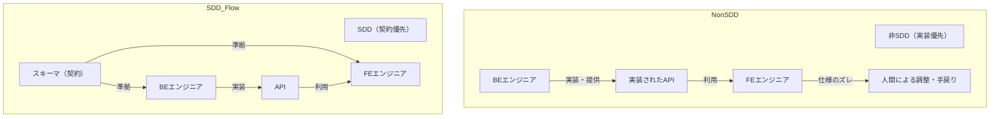

<SectionTitle title="スキーマ駆動開発のトレードオフ構造" />

---

## トレードオフとなるもの

1. `責任：FEエンジニア<->BEエンジニア` Who
2. `契約優先<->実装優先` When
3. `ベネフィット<->メンテナンスコスト` What

---

## 1

---

## そもそもインターフェースは誰が責任を持つものなのか？

- APIを実装するのはBEだからBEエンジニアだ！→BEエンジニアに定義してもらったIFがFEで取り回しづらい構造だったらその都度修正してもらう？提案時点で実装の目処を立てている可能性もある

- APIを使うのはFEだからFEエンジニアだ！→DB、実装の詳細を掴んでいない状況でのIFは突飛なものになる可能性がある

---

## そもスキーマ駆動に求められるもの

### FE

- APIのIFを手動で定義せずに済むようになりたい
- 早くAPIのIFを合意取り、実装に進みたい
- 手戻りが少ない形でAPI部の実装を進めたい

### BE

- FEが必要としているI/Oが知りたい
- バリデーションすべき値を把握したい
- APIによって何を果たしたいのか知りたい(もしかしたら要件レベルかも)
- APIドキュメントのメンテナンスコストを下げたい

---

## 提案する運用アプローチ

1. 両者が持つ範囲を決める
   - FE: APIの主目的、リクエスト・レスポンスと「各項目の説明」
   - BE: APIの振る舞いについての説明、リクエスト・レスポンスの具体的な返却パターン
2. FEエンジニアがまずspecを作成し、以下情報を書く
   - APIの目的
   - リクエスト（必須、文字数、Regex等も）
   - レスポンス
3. BEエンジニアがレビューし、commitを追加する
   - APIの振る舞いの詳細な説明
   - リクエスト・レスポンスのexample(複数パターンある場合は全て追加)
   - エラーパターン(4**,5**)
4. FEエンジニアがレビューし、合意が取れたらマージする
5. IF、ドキュメントを生成する

**このパターンは中間言語を使わない場合でも適用可能**

---

## イメージ図

---

## 例1: 契約優先の場合

FE: Nuxt,TypeScript
Schema: TypeSpec
BE: Go

---

## 例2: 実装優先の場合

FE:Nuxt,TypeScript
BE:Python

---

## 注意点

- 小規模、またはフルスタックに行う場合には向かないアプローチ（かえって冗長になる）
- エンジニアが互いのレイヤーを触れない可能性がある(セキュリティ、スキルセット、体制etc.)

---

<SectionTitle title="コストバランスと合意形成をどう考えるか"/>

---

## コストがベネフィットを上回る原因

1. コストが利点を上回っていない
   - セットアップ、学習、運用コストに対して生成されるIFが少ない
   - 一人でFE,BEどちらとも面倒を見ている
2. コストそのものが高すぎる
   - OpenAPIを保守し続けるのは結構大変
   - 小規模ならCIは大げさ、大規模なら手動同期は手間がかかりすぎる

 

### 規模に合った運用設計を！

---

## コードが優先？スキーマが優先？

- 実装されているBEコード量が多く、APIクライアントとして体裁が整っているなら実装優先の方がシフトしやすい
  - ただし実装優先した場合はFE側で変更に気づける仕組みが重要→pull型ではなくpush型で知らせる！
- まだBEコードが少なく、これから構築と設計を始めるのであれば契約優先で効果が出るが、コストバランスのパラダイムシフトを考えると将来的に移行しても良いかも

---

## コストバランスのパラダイムシフト

---
transition: fade
---

<SectionTitle :title="'プロジェクトの背景・時間軸・規模・ \r\nスキルセット等によって適した選定が必要！'"/>

---

<SectionTitle title="コストがもっとも小さい構成は？"/>
