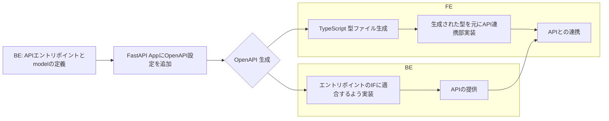

<SectionTitle title="PLAN-B: 異種間言語連携のハイブリッド戦略" />

---

## 戦略の前提

- 「銀の弾丸」は存在しない
- ユースケースの特徴ごとに「こうしたらゲインが出やすいのではないか」という提案

<br/>

### 時間軸やチーム規模、プロダクトの状況によって大きく変わるため、いくつかの事例別に適用方法を紹介

---

## A. 新規プロダクトのMVPが見えているスケール案件

<br/>

### 技術スタック

| 分野         | 言語/FW                |
| ------------ | ---------------------- |
| FE           | Nuxt                   |
| BE           | Python >=3.10, FastAPI |
| スキーマ定義 | なし                   |

<br/>

### ポイント

- PMFが見えているとはいえ、まだスピード感を持った開発が要求される
- 既に製造したAPIの仕様が大幅に変わる可能性は低い
- 新たに製造するAPIの数自体は少ない(アジャイル開発の場合、１フェーズで大量に機能をリリースすることは珍しい)

---

## Aへの提案： FastAPIのRouter実装を調整してOpenAPIファイル&TypeScriptの型を生成

<br/>

1. FE,BEの開発を非同期で行うためにまずIFの合意をとる
2. BEエンジニアがAPIエントリポイントとmodelを定義する
3. OpenAPI向けの設定をFastAPI Appに追加し、生成
4. 生成されたOpenAPI SpecからTypeScriptの型ファイルを生成

※3,4はスクリプト等で自動化する

<br/>



---

### e.g.

````md magic-move {lines: true}
```python
from fastapi import FastAPI
from fastapi.openapi.utils import get_openapi

app = FastAPI(
    title="サンプルAPI",
    openapi_url="/api/v1/openapi.json"
)
…

def custom_openapi():
    if app.openapi_schema:
        return app.openapi_schema

    app.openapi_schema = get_openapi(
        title="サンプルAPI",
        version="1.0.0",
        description="サンプルのAPIです",
        routes=app.routes,
        openapi_version="3.1.0",
    )
    return app.openapi_schema

app.openapi = custom_openapi

```

```python
from pydantic import BaseModel, Field
from datetime import datetime

class SampleRequest(BaseModel):
    id: str = Field("",summary="サンプルID",description="サンプルAPIのID")
    params: list[str] | None = Field(None, summary="サンプルパラメータ", description="サンプルAPIのパラメータ")

class SampleResponse(BaseModel):
    name: str = Field("",summary="名前",description="IDに紐づく名称")
    created_at: datetime
    updated_at: datetime

@app.get("/example",response_model=SampleResponse)
def read_root(sample_request:SampleRequest):
    now = datetime.now()
    return {
        "name": "サンプル 太郎",
        "created_at": now,
        "updated_at": now
        }
```
````

---

````md magic-move {lines: true}
```json
//openapi.json
{
  "openapi": "3.1.0",
  "info": { "title": "サンプルAPI", "description": "サンプルのAPIです", "version": "1.0.0" },
  "paths": {
    "/example": {
      "get": {
        "summary": "Read Root",
        "operationId": "read_root_example_get",
        "requestBody": {
          "content": { "application/json": { "schema": { "$ref": "#/components/schemas/SampleRequest" } } },
          "required": true
        },
        "responses": {
          "200": {
            "description": "Successful Response",
            "content": { "application/json": { "schema": { "$ref": "#/components/schemas/SampleResponse" } } }
          },
          "422": {
            "description": "Validation Error",
            "content": { "application/json": { "schema": { "$ref": "#/components/schemas/HTTPValidationError" } } }
          }
        }
      }
    }
  },
  …
```

```json
    "components": {
        "schemas": {
        "HTTPValidationError": {
            "properties": {
            "detail": { "items": { "$ref": "#/components/schemas/ValidationError" }, "type": "array", "title": "Detail" }
            },
            "type": "object",
            "title": "HTTPValidationError"
        },
        "SampleRequest": {
            "properties": {
            "id": {
                "type": "string",
                "title": "Id",
                "description": "サンプルAPIのID",
                "default": "",
                "summary": "サンプルID"
            },
            "params": {
                "anyOf": [{ "items": { "type": "string" }, "type": "array" }, { "type": "null" }],
                "title": "Params",
                "description": "サンプルAPIのパラメータ",
                "summary": "サンプルパラメータ"
            }
            },
            "type": "object",
            "title": "SampleRequest"
        },
        "SampleResponse": {
            "properties": {
            "name": {
                "type": "string",
                "title": "Name",
                "description": "IDに紐づく名称",
                "default": "",
                "summary": "名前"
            },
            "created_at": { "type": "string", "format": "date-time", "title": "Created At" },
            "updated_at": { "type": "string", "format": "date-time", "title": "Updated At" }
            },
            "type": "object",
            "required": ["created_at", "updated_at"],
            "title": "SampleResponse"
        },
```

```json
        "ValidationError": {
            "properties": {
                "loc": {
                "items": { "anyOf": [{ "type": "string" }, { "type": "integer" }] },
                "type": "array",
                "title": "Location"
                },
                "msg": { "type": "string", "title": "Message" },
                "type": { "type": "string", "title": "Error Type" }
            },
            "type": "object",
            "required": ["loc", "msg", "type"],
            "title": "ValidationError"
            }
        }
    }
}
```
````

---

## B. レガシーシステムのAPIを整理して再定義し直す刷新案件

<br/>

### 技術スタック

| 分野 | 言語/FW |
| ---- | ------- |
| FE   | Nuxt    |
| BE   | Go      |

<br/>

### ポイント

- APIが果たすべき役割の本質はほとんど変わらない(粒度や切り口は変わる)
  - 機能廃止・縮小はあるかも
- バックエンドは１から製造し直す(現行コードの流用が困難であるケースを想定)
  - 現行の振る舞いを検証するため、FEとの製造にタイムラグがある

---

## C. FE・BEどちらとも一人で面倒見る機能拡張案件

<br/>

### 技術スタック

| 分野 | 言語/FW |
| ---- | ------- |
| FE   | Nuxt    |
| BE   | Java    |

### ポイント

- 必ずしも個人開発でなく、feature別に割り振られるケースもある。
- 比較的開発フェーズは落ち着いている
